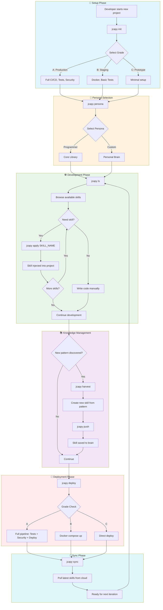

# JCapy User Workflow: Building a Project

## Overview
This document illustrates the complete user journey when building a project using JCapy CLI commands.

---

## User Workflow Diagram



---

## Command Reference by Phase

| Phase | Command | Purpose |
|-------|---------|---------|
| **Setup** | `jcapy init` | Scaffold project with grade selection |
| **Persona** | `jcapy persona` / `jcapy p` | Switch active brain/persona |
| **Browse** | `jcapy ls` / `jcapy list` | View available skills |
| **Search** | `jcapy search QUERY` | Find skills by content |
| **Apply** | `jcapy apply SKILL` | Inject skill into project |
| **Create** | `jcapy harvest` / `jcapy new` | Extract new skill from pattern |
| **Deploy** | `jcapy deploy` | Grade-aware deployment |
| **Sync** | `jcapy sync` | Pull updates from cloud |
| **Push** | `jcapy push` | Upload local changes |
| **Health** | `jcapy doctor` / `jcapy chk` | Check system status |

---

## Quick Start Example

```bash
# 1. Initialize project
mkdir my-app && cd my-app
jcapy init

# 2. Browse skills
jcapy ls

# 3. Apply useful skills
jcapy apply deploy_react
jcapy apply structure_docs

# 4. Deploy
jcapy deploy

# 5. Save new patterns
jcapy harvest  # Create skill from discovered pattern

# 6. Sync with cloud
jcapy push     # Upload to GitHub
jcapy sync     # Pull latest
```
