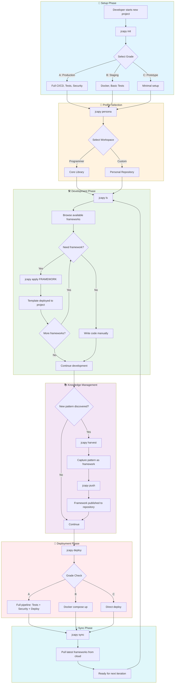

# JCapy User Workflow: Building a Project

## Overview
This document illustrates the complete user journey when building a project using JCapy CLI commands.

---

## Terminology Reference

| JCapy Term | Industry Standard | Description |
|------------|-------------------|-------------|
| Framework | Template/Scaffold | Reusable code pattern with executable steps |
| Library | Knowledge Base | Collection of frameworks organized by domain |
| Persona | Workspace/Profile | Isolated environment with custom library |
| Harvest | Capture Pattern | Extract reusable code into a framework |
| Apply | Deploy Template | Inject framework code into current project |
| Brain | Repository | Personal or shared framework storage |

---

## User Workflow Diagram



---

## Command Reference by Phase

| Phase | Command | Purpose |
|-------|---------|---------|
| **Setup** | `jcapy init` | Scaffold project with grade selection |
| **Profile** | `jcapy persona` / `jcapy p` | Switch active workspace/profile |
| **Browse** | `jcapy ls` / `jcapy list` | View available frameworks |
| **Search** | `jcapy search QUERY` | Find frameworks by content |
| **Deploy Template** | `jcapy apply FRAMEWORK` | Inject framework into project |
| **Capture Pattern** | `jcapy harvest` / `jcapy new` | Extract new framework from code |
| **Deploy** | `jcapy deploy` | Grade-aware deployment pipeline |
| **Pull** | `jcapy sync` | Pull updates from repository |
| **Publish** | `jcapy push` | Upload local changes to repository |
| **Diagnose** | `jcapy doctor` / `jcapy chk` | Health-check system status |
| **Preferences** | `jcapy config` | View/set UX preferences |
| **Undo** | `jcapy undo` | Restore last deleted framework |
| **Onboarding** | `jcapy tutorial` | Interactive getting-started guide |

---

## Quick Start Example

```bash
# 1. Initialize project
mkdir my-app && cd my-app
jcapy init

# 2. Browse frameworks
jcapy ls

# 3. Deploy templates to project
jcapy apply deploy_react
jcapy apply structure_docs

# 4. Deploy to environment
jcapy deploy

# 5. Capture new patterns
jcapy harvest  # Extract pattern as reusable framework

# 6. Publish & sync with repository
jcapy push     # Publish to GitHub
jcapy sync     # Pull latest frameworks
```

---

## UX Configuration

Customize your JCapy experience:

```bash
# Set high-contrast theme
jcapy config set theme=high-contrast

# Disable contextual hints
jcapy config set hints=false

# Enable reduced motion (accessibility)
jcapy config set reduced_motion=true
```

Available themes: `default`, `high-contrast`, `monochrome`
