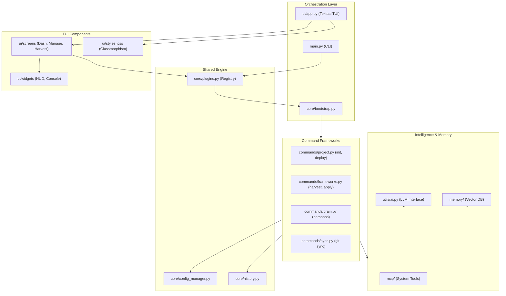

# JCapy Architecture Overview

JCapy is a unified "Knowledge Operating System" designed for the "One-Army" protocol. It bridges CLI and TUI experiences through a shared command engine and a modular extension system.

## 🏗️ System Architecture

## 📋 Core Layers

### 1. Orchestration Layer
The entry points for JCapy. `main.py` handles direct CLI calls, while `JCapyApp` (Textual) provides the immersive terminal experience. `bootstrap.py` serves as the glue, discovery, and registration hub.

### 2. Shared Engine (Command Registry)
The `CommandRegistry` in `plugins.py` is the heart of JCapy. It handles:
- **Registration**: Mapping command names to Python functions.
- **Piping**: Unix-style `|` logic between commands.
- **Capturing**: Real-time output streaming from commands to the UI.
- **TUI Routing**: Native mapping of interactive commands to Textual screens.

### 3. Modular Command Frameworks
Commands are decoupled from the core UI.
- **Project**: Management of local scaffolding and deployment.
- **Skills**: The "Knowledge" aspect—harvesting patterns and applying them.
- **Personas**: Identity management and environment isolation.

### 4. UI Design System
Built on Textual, featuring:
- **Glassmorphism**: Layered transparency and dynamic focus effects defined in `styles.tcss`.
- **HUD (Heads-Up Display)**: Real-time system pulse and project status widgets.
- **Dual Terminal**: Side-by-side execution and command history logs.

### 5. Memory & Intelligence
- **Vector Memory**: ChromaDB storage for long-term project context.
- **MCP Server**: Integration with the Model Context Protocol for advanced agentic tool-use.
- **AI Utils**: Provider-agnostic abstraction for Gemini, OpenAI, etc.

## 💾 Persistence
- **Global**: `~/.jcapy/config.json` stores user preferences and the Persona library.
- **Local**: `.jcapyrc` stores project-specific metadata (Grade, Name).
