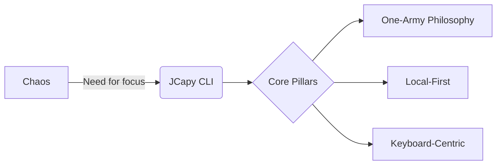

# The JCapy Journey: From Terminal to Command Center

> "One Developer. One Army. One Interface."

This document visualizes the evolution of JCapy—where it started, where it stands today, and the orbital future ahead.

---

## 1. Genesis: The Spark (v0.1)
**Goal**: Stop context-switching. Bring documentation, execution, and AI into the terminal.



- **The Problem**: Developers juggle 10+ windows (Browser, Terminal, Notes, AI Chat).
- **The Solution**: A unified TUI wrapper around your entire workflow.

---

## 2. Evolution: The Climb (v0.5 - v0.9)
We iterated rapidly to turn a script into a product.

### Phase 1-3: Foundations
- **Streaming**: Moving from static output to real-time logs (`ProcessManager`).
- **Intelligence**: Adding AI "Brainstorming" directly in the console.

### Phase 4: The "Premium" Feel (UX Polish)
- 🎨 **Glassmorphism**: Replaced boring borders with heavy/light box drawing characters.
- 🎬 **Cinematic Startup**: Added the "Matrix Rain" intro sequence.
- 💓 **Micro-Animations**: Spinners, heartbeats, and smooth transitions.

### Phase 5: Power Tools
- 🛠 **Native Grep & Edit**: Built-in tools so you never leave the app.
- 🧠 **Neovim RPC**: "Smart Edit" that opens files in your host Neovim instance.
- ⌨️ **Interactive Stream**: Full `stdin` support and `copy/paste` handling.

---

## 3. Present Day: Production Ready (v1.0)
**Status**: Stable, Verified, Secure.

| Feature | State |
| :--- | :--- |
| **Startup Time** | ⚡️ ~0.25s (Instant) |
| **Security** | 🛡️ Hardened (No `shell=True`, Escaped Paths) |
| **Compatibility** | 💻 MacOS/Linux, Zsh/Bash |
| **User Experience** | 💎 High-End TUI (Visual Mode, Leader Key) |

> **JCapy v1.0 is the ultimate "Developer's Console" for the solo architect.**

---
## 4. By The Numbers (v1.0 Metrics)

Quantitative proof of the system's scale and quality.

### Codebase Vitality
- **Total Size**: **13,543 lines** of specific, hand-crafted python/shell execution logic.
- **Complexity**:
    - `commands/` (~40%): The business logic (Harvest/Apply).
    - `ui/tui.py` (1,208 lines): The "God Class" handling the Visual Interface (the primary target for v2.0 refactor).
    - `scripts/`: ~30% devoted to rigorous testing and deployment automation.

### Assessment Scorecard
*Audit performed on Feb 17, 2026*

| Category | Score | Verdict |
| :--- | :--- | :--- |
| **UX & Aesthetics** | **9.5/10** | 💎 **World Class**. Glassmorphism, Matrix Intro, Kinetic Typing. |
| **Security** | **9.0/10** | 🛡️ **Fortified**. Zero `shell=True`, Strict Path Escaping. |
| **Functionality** | **8.0/10** | 🛠️ **Production Ready**. Core loop works perfectly. |
| **Architecture** | **7.5/10** | 🏗️ **Strained**. Monolithic design reached its limit at v1.0. |

> **Overall**: **8.5/10** - A powerful tool ready for daily use, with a clear path to v2.0.

---

## 5. The Horizon: Orbital Architecture (v2.0)
**Challenge**: Scaling beyond a single process.
**Solution**: The **Client-Server Split**.

```mermaid
graph TB
    subgraph "Legacy (v1.0)"
        A[Monolithic TUI Process]
    end

    subgraph "Future (v2.0)"
        B[JCapy Terminal (Client)] <-->|mTLS / gRPC| C[JCapy Brain (Daemon)]
        C <-->|WASM| D[Plugin Ecosystem]
        C <-->|Bridge| E[Clawdbot Assistant]
        C <-->|ChromaDB| F[Persistent Memory]
    end
```

### Key Innovations
1.  **The Brain (`jcapyd`)**: A headless daemon that never sleeps. It remembers context, runs deployments, and indexes knowledge 24/7.
2.  **The Terminal (`jcapy-cli`)**: A lightweight, instant-on viewer. Connect from any window, or even a web browser.
3.  **Digital Fortress**: Zero-Trust security with mTLS and encrypted secrets.
4.  **Clawdbot Bridge**: Offloading "Assistant" tasks (reminders, chat) to Clawdbot while JCapy handles "Execution" (code, deploy).

---

## Summary
- **Past**: A script to run commands.
- **Present**: A polished, interactive TUI for deep work.
- **Future**: A distributed platform for orbital development.
