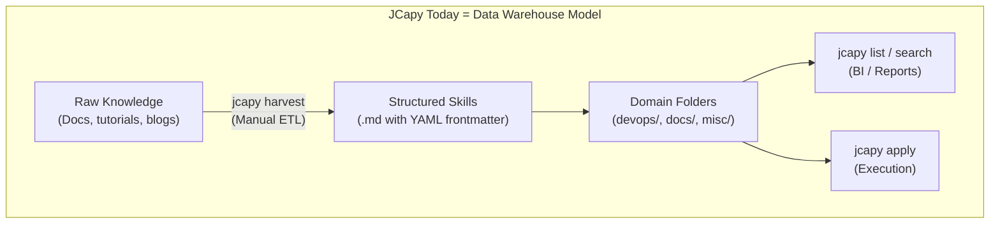
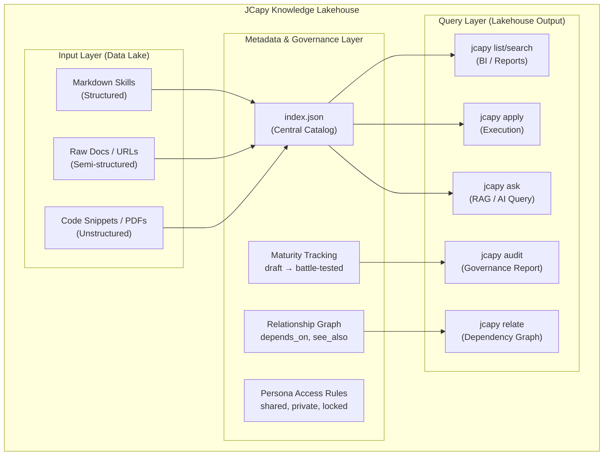

# JCapy Knowledge Architecture — The Lakehouse Lens

> **Purpose**: Compare JCapy's knowledge storage architecture to the Data Warehouse / Data Lake / Data Lakehouse paradigms. Map the analogy, identify feature gaps, and quantify the improvement of a Lakehouse-inspired redesign.

---

## Angle 1: JCapy as a Data Architecture Analogy

### Where JCapy Sits Today

JCapy's current knowledge system maps almost exactly to the **Data Warehouse** model:



| Data Warehouse Trait | JCapy Equivalent | Evidence |
|---|---|---|
| **Structured data only** | Skills must follow YAML frontmatter + markdown template | `TEMPLATE_FRAMEWORK.md` enforces schema |
| **ETL before storage** | `jcapy harvest` transforms raw docs into structured skills | `harvest_framework()` in `frameworks.py` |
| **Rigid schema** | Fixed domains: `devops/`, `docs/`, `misc/`, `deployment/` | Filesystem walk in `list_frameworks()` |
| **Single-purpose queries** | `jcapy list` and `jcapy search` — text match only | `search_frameworks()` uses string matching |
| **No raw data retained** | Original docs discarded after harvest | Only the structured `.md` output survives |

### What's Missing (compared to Lake & Lakehouse)

| Missing Feature | Data Lake Has It | Lakehouse Has It | JCapy Impact |
|---|---|---|---|
| **Store anything, structured or not** | ✅ | ✅ | JCapy can't store PDFs, images, code repos, links as knowledge |
| **Metadata catalog** | ❌ | ✅ | No central index — discovery is `os.walk()` every time |
| **Cross-references** | ❌ | ✅ | Skill A can't link to Skill B; no dependency graph |
| **Governance layer** | ❌ | ✅ | No version tracking, no quality scores, no deprecation flags |
| **Multi-format querying** | ❌ | ✅ | Can only query by filename/text, not by tags, grade, date, relationships |
| **Schema evolution** | ❌ | ✅ | Adding new metadata fields requires touching every skill file |

### Verdict: JCapy Is a Data Warehouse

**Strengths of this model:**
- Simple, zero-dependency, filesystem-native
- Easy to understand and debug
- Works well at small scale (15 skills today)

**Breaking point:**
- Degrades as skill count grows (50+ skills = `os.walk()` gets slow, search gets noisy)
- No way to discover *relationships* between skills
- No metadata-driven querying (e.g., "show me all Grade A deployment skills created this year")

---

## Angle 2: Data Platform Feature Gap

Mapping the three architecture diagrams from the comparison image:

### The Image Decoded

| Architecture | Input | Processing | Output | Governance |
|---|---|---|---|---|
| **Data Warehouse** | Structured data only | ETL (strict) | BI + Reports | None explicit |
| **Data Lake** | Structured + Semi-structured + Unstructured | ETL (flexible) | BI + Reports + Data Science + ML | None |
| **Data Lakehouse** | Structured + Semi-structured + Unstructured | ETL (flexible) | BI + Reports + Data Science + ML | **Metadata & Governance Layer** |

### JCapy Feature Gap Against Each Model

#### vs. Data Lake (What JCapy Would Gain)

| Data Lake Feature | JCapy Gap | Potential Adaptation |
|---|---|---|
| **Accept any data format** | JCapy only stores `.md` files | Accept raw docs, PDFs, URLs, code snippets as "raw knowledge" alongside structured skills |
| **Multiple output types** | `list`, `search`, `apply` only | Add `jcapy ask` (RAG query), `jcapy relate` (find connections), `jcapy audit` (quality check) |
| **ETL flexibility** | `harvest` is all-or-nothing | Support partial harvests, incremental updates, draft→review→publish pipeline |

**Gap size: 🟡 Medium** — JCapy could store more formats without architectural overhaul.

#### vs. Data Lakehouse (The Big Jump)

| Lakehouse Feature | JCapy Gap | Potential Adaptation |
|---|---|---|
| **Metadata & Governance Layer** | ❌ Completely missing | `~/.jcapy/index.json` — central catalog of all skills with tags, dates, grades, relationships |
| **Quality governance** | No quality tracking | Skill maturity levels: `draft → reviewed → battle-tested → deprecated` |
| **Cross-references** | Skills are isolated islands | Skill A declares `depends_on: [skill-b]` or `see_also: [skill-c]` in frontmatter |
| **Schema evolution** | YAML frontmatter is implicit | Versioned schema with migration support (v1 → v2 frontmatter) |
| **Time travel** | `~/.jcapy/undo` exists but limited | Full version history per skill via Git + metadata timestamps |
| **Access control** | Persona isolation only | Per-skill permissions: `locked`, `shared`, `persona-private` |

**Gap size: 🔴 Large** — This is a fundamental architectural upgrade, not just feature additions.

---

## Angle 3: How Big Is the Lakehouse Improvement?

### Quantifying the Impact

| Dimension | Current (Warehouse) | After Lakehouse Redesign | Improvement |
|---|---|---|---|
| **Skill discovery speed** | `O(n)` filesystem walk | `O(1)` index lookup | **10-50x faster** at 100+ skills |
| **Search quality** | Filename/content text match | Tag + grade + date + relationship filtering | **Dramatically better** precision |
| **Knowledge relationships** | Zero — every skill is an island | Dependency graph, "see also" links, persona-aware grouping | **Entirely new** capability |
| **Quality tracking** | Manual "grade" in frontmatter (optional) | Maturity lifecycle: `draft → battle-tested → deprecated` | **Governance emerges** |
| **Multi-format knowledge** | `.md` only | `.md` + URLs + code snippets + PDFs (raw + processed) | **3-4x more knowledge** capturable |
| **AI queryability** | None — AI can't search your skills | RAG over `index.json` + skill content (via `jcapy ask`) | **Game-changer** for brainstorm |
| **Maintenance burden** | Low (nothing to maintain) | Medium (index must stay in sync) | **Trade-off** — complexity increases |

### The Honest Assessment

```
┌─────────────────────────────────────────────────────────────┐
│  IMPROVEMENT SCALE (Warehouse → Lakehouse)                  │
│                                                             │
│  Discovery & Search:     ████████████████████░░  (9/10)     │
│  Knowledge Relationships:████████████████████░░  (9/10)     │
│  AI Integration:         ████████████████░░░░░░  (8/10)     │
│  Quality Governance:     ██████████████░░░░░░░░  (7/10)     │
│  Multi-format Storage:   ██████████░░░░░░░░░░░░  (5/10)     │
│                                                             │
│  Implementation Effort:  ████████████████░░░░░░  (8/10) ⚠️  │
│  Complexity Added:       ████████████░░░░░░░░░░  (6/10) ⚠️  │
│                                                             │
│  OVERALL ROI:            ████████████████░░░░░░  (8/10) ✅  │
└─────────────────────────────────────────────────────────────┘
```

### Is It Worth It?

**Yes, but in phases. Don't try to build the entire Lakehouse at once.**

The highest-ROI improvements can be delivered incrementally:

| Phase | What | Effort | Impact |
|---|---|---|---|
| **Phase 1** | `index.json` metadata catalog (auto-generated on harvest/startup) | 2-3 days | Unlocks fast search, filtering, relationships |
| **Phase 2** | Enrich frontmatter schema: `depends_on`, `see_also`, `maturity`, `last_used` | 1-2 days | Governance layer emerges naturally |
| **Phase 3** | `jcapy ask` — RAG query over indexed skills | 3-5 days | AI integration for knowledge retrieval |
| **Phase 4** | Raw knowledge store: accept URLs, snippets, PDFs alongside skills | 3-5 days | Multi-format "Data Lake" capability |

---

## Proposed Architecture: JCapy Knowledge Lakehouse



### What This Gives You

1. **Every skill is indexed** — `index.json` is rebuilt on `jcapy harvest` and `jcapy startup`, making search instant
2. **Relationships emerge** — "This deploy skill depends on the Docker skill" is now explicit and queryable
3. **Quality is visible** — `jcapy audit` shows which skills are stale, which are battle-tested, which need review
4. **AI can search your brain** — `jcapy ask "how do I deploy to Firebase?"` does RAG over your entire skill library
5. **Raw knowledge is kept** — Original docs, URLs, and code snippets live alongside processed skills

---

## Comparison to Previous Gap Analyses

| Feature Idea | Source | Lakehouse Enables? |
|---|---|---|
| Smart LLM routing (`jcapy brain route`) | Dataiku gap analysis | ✅ Index provides context for model selection |
| RAG over skill library (`jcapy ask`) | Dataiku gap analysis | ✅ This IS the Lakehouse query layer |
| Prompt lab (`jcapy prompt lab`) | Dataiku gap analysis | ✅ Prompts stored as indexed skills |
| Persistent memory | Clawdbot gap analysis | ✅ Memory stored as indexed raw knowledge |
| MCP integration | Clawdbot gap analysis | 🟡 Orthogonal — MCP doesn't require Lakehouse |
| Skill marketplace (`jcapy install`) | Clawdbot gap analysis | ✅ Index makes skill import/export structured |

> [!IMPORTANT]
> The Lakehouse redesign is the **architectural foundation** that makes most of the ideas from both previous gap analyses feasible. Without it, each feature is a standalone hack. With it, they all share a common metadata backbone.

---

## Bottom Line

**JCapy today = Data Warehouse**: rigid, simple, works at small scale.

**JCapy's sweet spot = Data Lakehouse**: structured + flexible, metadata-governed, multi-format, AI-queryable.

**The improvement is 8/10** — transformative for knowledge management and AI integration, with the trade-off being moderate implementation complexity (manageable in 4 phases over ~2 weeks).

**Don't become a Data Lake** — dumping everything without governance (no metadata layer) would make JCapy's brain a swamp. The governance layer is what makes the Lakehouse model powerful.
