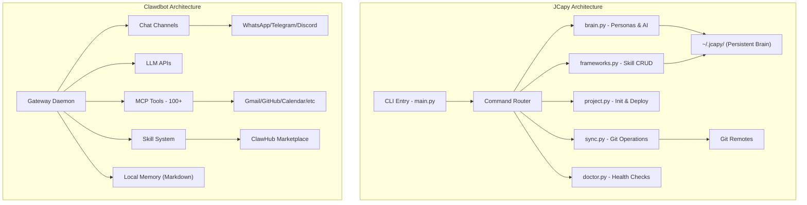

# JCapy vs Clawdbot (OpenClaw) — Gap Analysis

> **Purpose**: Honest assessment of where JCapy stands relative to Clawdbot/OpenClaw, what's unique to JCapy, and what gaps matter most for a solo developer.

---

## TL;DR Verdict

**They're solving different problems.** Clawdbot is a *personal AI assistant gateway* (chat → action). JCapy is a *developer knowledge orchestrator* (skill library → project scaffolding). The "gap" isn't about catching up — it's about deciding which Clawdbot ideas are worth stealing.

---

## Feature Comparison Matrix

| Capability | JCapy | Clawdbot | Gap Severity |
|---|---|---|---|
| **CLI Interface** | ✅ Python argparse + Rich TUI | ✅ Node.js CLI | —  |
| **Skill/Framework System** | ✅ Markdown-based, harvest/apply/merge | ✅ Markdown SKILL.md + marketplace | 🟡 Medium |
| **Persona System** | ✅ Multi-persona with Git-backed libraries | ❌ Single identity | **JCapy wins** |
| **Project Scaffolding** | ✅ Grade-aware init + deploy pipeline | ❌ Not a project tool | **JCapy wins** |
| **Git Sync** | ✅ Persona-aware sync/push | ❌ No built-in sync | **JCapy wins** |
| **AI Brainstorming** | ✅ Multi-provider (Gemini/OpenAI/DeepSeek) | ✅ Multi-model (Claude/GPT/Gemini/local) | 🟡 Medium |
| **System Doctor/Health** | ✅ Full system health checker | ❌ Manual | **JCapy wins** |
| **Multi-Platform Chat** | ❌ Terminal only | ✅ WhatsApp/Telegram/Discord/Slack/iMessage | 🔴 Large |
| **Persistent Memory** | ❌ Config-only persistence | ✅ Markdown-based memory across sessions | 🔴 Large |
| **Proactive Comms** | ❌ None | ✅ Heartbeats, morning briefings, alerts | 🟡 Medium |
| **MCP Tool Ecosystem** | ❌ None | ✅ 100+ integrations via MCP | 🔴 Large |
| **Full System Access** | 🟡 Shell via `apply` only | ✅ File/terminal/browser/shell | 🟡 Medium |
| **Voice Interface** | ❌ None | ✅ macOS/iOS/Android speech | 🟡 Medium |
| **Smart Home** | ❌ None | ✅ Hue, Home Assistant | ⚪ Irrelevant |
| **Skill Marketplace** | ❌ None | ✅ ClawHub community skills | 🟡 Medium |
| **Web Browsing** | ❌ None | ✅ Semantic snapshots (Accessibility Tree) | 🟡 Medium |
| **Animations/UX** | ✅ Matrix rain, typewriter, cinematic intro | ❌ Plain CLI | **JCapy wins** |
| **Undo System** | ✅ Destructive action undo stack | ❌ None | **JCapy wins** |
| **Tutorial/Onboarding** | ✅ Interactive guided tutorial | ❌ Basic `onboard` command | **JCapy wins** |
| **Executable Knowledge** | ✅ Parse and run bash from markdown | 🟡 Skills can invoke tools | **JCapy wins** |
| **Deploy Pipeline** | ✅ Grade A/B/C deployment logic | ❌ Not a deployment tool | **JCapy wins** |

---

## Where JCapy Is Ahead

JCapy has several unique strengths that Clawdbot doesn't attempt:

1. **Persona-driven knowledge isolation** — Switching between "Programmer", "DevOps", "Designer" with separate Git-backed skill libraries is a novel concept. Clawdbot has one monolithic identity.

2. **Executable Knowledge** — `jcapy apply` parses markdown and executes embedded bash blocks. This is "Infrastructure as Documentation." Clawdbot skills instruct the AI; JCapy skills *are* directly executable.

3. **Grade-aware deployment** — Project grade (A/B/C) controlling deploy pipeline strictness is a one-army philosophy feature with no Clawdbot equivalent.

4. **Framework harvesting** — The wizard to extract knowledge from existing docs into structured, reusable frameworks is unique to JCapy.

5. **Cinematic UX** — Matrix rain intros, typewriter effects, themed glass-box panels. JCapy *feels* like a product, not a utility.

---

## Key Differences (The Real Gaps)

### 🔴 Critical Gaps (Game-changers if JCapy adopted them)

**1. MCP Integration Layer**
Clawdbot connects to 100+ services (Gmail, Calendar, GitHub, Notion) through [Model Context Protocol](https://modelcontextprotocol.io). This is the biggest architectural difference — Clawdbot is an *integration hub*, JCapy is a *local tool*.

> **Opportunity for JCapy**: Add MCP client support so `jcapy brainstorm` or a new `jcapy ask` command can use MCP servers (GitHub, filesystem, databases) as context. This would make the AI features dramatically more powerful without reinventing integrations.

**2. Persistent Memory**
Clawdbot remembers preferences, past conversations, and patterns across sessions using *externalized markdown memory*. JCapy only persists config (`~/.jcapy_config.json`).

> **Opportunity for JCapy**: Store brainstorm session history, frequently-used frameworks, and project context in `~/.jcapy/memory/` as markdown. Feed this back into future brainstorm sessions.

**3. Multi-Channel Access**
Clawdbot lets you interact via WhatsApp, Telegram, Discord, etc. You can ask it to run a deploy from your phone.

> **Opportunity for JCapy**: This is Clawdbot's *raison d'être* but likely **out of scope** for JCapy's philosophy. A lightweight alternative: a simple Telegram bot that triggers `jcapy deploy` or `jcapy sync` via SSH on your dev machine.

### 🟡 Medium Gaps (Nice to have)

| Gap | Pragmatic JCapy Equivalent |
|---|---|
| **Skill marketplace** | JCapy already has Git-synced persona libraries. Add a `jcapy install <git-url>` to clone community skill packs |
| **Proactive communication** | Add cron-based `jcapy remind` — check for stale branches, outdated deps, unsynced personas |
| **Voice interface** | Low priority. Terminal-first is JCapy's identity |
| **Web browsing** | Add `jcapy research <url>` using a simple HTTP fetch + markdown conversion for feeding into brainstorm |

---

## Architecture Comparison

**Key architectural difference**: Clawdbot is a **always-on daemon** connecting external services. JCapy is a **CLI invoked on-demand** managing local knowledge. These are fundamentally different runtime models.

---

## Strategic Recommendations

### ✅ Recommended Adoptions (High ROI, Low Effort)

1. **Persistent Memory** → Store brainstorm history + project context in `~/.jcapy/memory/`
2. **`jcapy install <url>`** → Clone community skill packs from Git URLs
3. **MCP Client** → Add MCP support to `jcapy brainstorm` for richer AI context
4. **Cron Reminders** → `jcapy remind` for stale branches, outdated deps

### ⚠️ Consider These (Medium ROI)

5. **Lightweight remote trigger** — Telegram bot → SSH → `jcapy deploy`
6. **Web research** — fetch URL → markdown → feed to brainstorm

### ❌ Out of Scope (Wrong philosophy for JCapy)

7. **Multi-platform chat gateway** — JCapy is a developer CLI, not a chat assistant
8. **Smart home** — irrelevant to developer workflows
9. **Voice interface** — terminal-first identity
10. **Always-on daemon** — JCapy's on-demand invocation is simpler and more secure

---

## Gap Score Summary

| Category | JCapy | Clawdbot | Notes |
|---|---|---|---|
| **Developer Workflow** | ⭐⭐⭐⭐⭐ | ⭐⭐ | JCapy purpose-built for this |
| **Knowledge Management** | ⭐⭐⭐⭐⭐ | ⭐⭐⭐ | JCapy's harvest/memorize is unmatched |
| **AI Integration Depth** | ⭐⭐⭐ | ⭐⭐⭐⭐⭐ | JCapy brain catching up via v2.0 roadmap |
| **Distribution/Packaging** | ⭐⭐⭐⭐ | ⭐⭐⭐ | JCapy has Homebrew + pip |
| **UX Polish** | ⭐⭐⭐⭐ | ⭐⭐ | JCapy's animations and TUI are superior |
| **Integration Breadth** | ⭐ | ⭐⭐⭐⭐⭐ | Clawdbot connects to everything |
| **Security** | ⭐⭐⭐⭐⭐ | ⭐⭐ | JCapy 2.0 mTLS + WASM sandboxing |
| **One-Army Friendliness** | ⭐⭐⭐⭐⭐ | ⭐⭐⭐ | JCapy is built for solo devs |
| **Context Sovereignty** | ⭐⭐⭐⭐⭐ | ⭐⭐ | JCapy 2.0 ensures 100% local context control |

**Overall**: JCapy is a **focused, opinionated developer tool** that excels at what it does. Clawdbot is a **broad AI assistant** that does many things but isn't purpose-built for development workflows. The gap is in **AI integration depth** (MCP + memory), not in core functionality.
