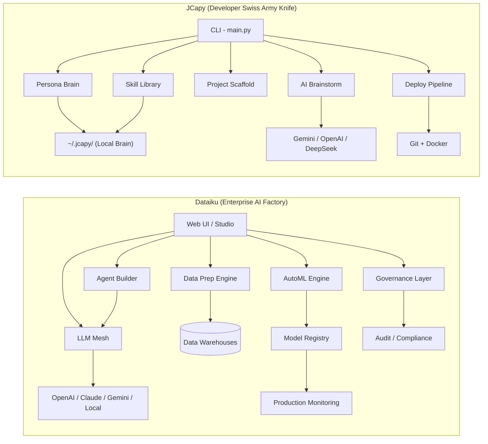

# JCapy vs Dataiku — Gap Analysis

> **Purpose**: Honest assessment of how JCapy compares to Dataiku, what's actually comparable vs what's not, and what (if anything) is worth borrowing.

---

## TL;DR Verdict

**These are not competitors. They exist in completely different universes.**

Dataiku is a **$2.4B enterprise AI platform** serving Fortune 500 companies at €50K–€250K/year. JCapy is a **free, CLI-based developer knowledge tool** built by one person for one person. Comparing them is like comparing a Swiss Army knife to an aircraft carrier — both are useful, neither replaces the other.

The real question isn't "how far is the gap" — it's **"what ideas from Dataiku's architecture could make JCapy smarter without bloating it?"**

---

## What Dataiku Actually Is

| Dimension | Dataiku |
|---|---|
| **Category** | Enterprise AI/ML Platform (Gartner Magic Quadrant Leader) |
| **Team** | ~1,800 employees, $400M+ raised |
| **Pricing** | €50K–€250K/year enterprise licenses |
| **Users** | Data scientists, ML engineers, business analysts, IT teams |
| **Runtime** | Always-on web platform (cloud or self-hosted) |
| **Core Value** | End-to-end ML lifecycle: data prep → model training → deployment → monitoring |

### Dataiku's Key Capabilities
1. **GenAI & AI Agents** — Visual agent builder, Agent Hub, LLM Mesh (secure gateway to thousands of LLMs)
2. **AutoML** — Drag-and-drop model building, feature engineering, experiment tracking
3. **Data Prep** — Visual ETL, 30+ data connectors, GenAI-powered data cleaning
4. **MLOps** — Model deployment, drift monitoring, A/B testing, automated retraining
5. **AI Governance** — Risk management, sign-off workflows, compliance, audit trails
6. **RAG / Chat Apps** — "Dataiku Answers" — build RAG chatbots with zero code
7. **Prompt Studios** — Prompt design, evaluation, cost comparison across models
8. **Analytics & BI** — Dashboards, visualizations, GenAI-powered storytelling
9. **LLM Fine-tuning** — Visual interface for fine-tuning Hugging Face / OpenAI models
10. **Multi-cloud** — AWS, GCP, Azure, Snowflake, Databricks integrations

---

## What JCapy Actually Is

| Dimension | JCapy |
|---|---|
| **Category** | Developer CLI / Knowledge Orchestrator |
| **Team** | Solo developer |
| **Pricing** | Free / Open source |
| **Users** | The developer who built it (and anyone who installs it) |
| **Runtime** | On-demand CLI invocation |
| **Core Value** | Organize dev knowledge → scaffold projects → deploy consistently |

### JCapy's Key Capabilities
1. **Persona System** — Switch between role-based skill libraries (Programmer, DevOps, Designer)
2. **Framework Harvesting** — Extract reusable patterns from docs into structured markdown skills
3. **Executable Knowledge** — Parse and run bash blocks from markdown (`jcapy apply`)
4. **Grade-Aware Deploy** — A/B/C grade controls deployment pipeline strictness
5. **AI Brainstorming** — Multi-provider chat (Gemini/OpenAI/DeepSeek)
6. **Git Sync** — Persona-aware Git operations
7. **System Doctor** — Health checks for dev environment
8. **Cinematic UX** — Matrix rain, typewriter effects, glass-box panels

---

## The Honest Comparison

### 🔴 Where Dataiku Is Galaxies Ahead (Irrelevant Gaps)

These are things Dataiku does that JCapy **should never try to do**:

| Capability | Dataiku | JCapy | Verdict |
|---|---|---|---|
| **AutoML / Model Training** | Full visual + code ML pipeline | ❌ Not a ML tool | **Different planet** |
| **Data Prep / ETL** | 30+ connectors, visual recipes | ❌ Not a data tool | **Different planet** |
| **Model Monitoring / Drift** | Production model health tracking | ❌ Not relevant | **Different planet** |
| **AI Governance / Compliance** | Enterprise audit trails, sign-off | ❌ Solo dev doesn't need this | **Different planet** |
| **Dashboards / BI** | Visual analytics, charts | ❌ Terminal-first | **Different planet** |
| **Multi-user Collaboration** | Teams of dozens working together | ❌ One-army by design | **Different planet** |
| **Fine-tuning LLMs** | Visual fine-tuning interface | ❌ Not JCapy's scope | **Different planet** |

> [!NOTE]
> These gaps are **by design, not by deficiency**. JCapy is a Swiss Army knife for a solo developer. Dataiku is a full factory floor for enterprise data teams. Closing these gaps would dilute JCapy's core value proposition.

---

### 🟡 Where Dataiku Has Interesting Ideas to Borrow

These are Dataiku concepts that **could translate** into JCapy's one-army philosophy:

| Dataiku Concept | What It Does | JCapy Equivalent Today | Potential JCapy Adaptation |
|---|---|---|---|
| **LLM Mesh** | Secure gateway + routing across multiple LLMs | `jcapy brainstorm` supports 3 providers manually | `jcapy brain route` — auto-select cheapest/fastest model per task type |
| **Agent Hub** | Centralized library of approved, reusable AI agents | Persona system (roles) | Expand personas to include **agent configs** — each persona could carry prompt templates + tool permissions |
| **Prompt Studios** | Design, test, compare prompts across models | ❌ None | `jcapy prompt lab` — A/B test prompts against different models, save winners to persona library |
| **RAG / Knowledge Chat** | Chat with your documents using vector embeddings | ❌ None | `jcapy ask` — RAG over your skill library markdown files. Your own knowledge, queryable. |
| **Pipeline Automation** | Scheduled, repeatable data/ML workflows | `jcapy deploy` (one-shot) | `jcapy automate` — cron-like recurring tasks (sync, health checks, backups) |
| **Quality Guard** | Evaluate AI output quality with metrics | ❌ None | Add simple quality checks to `jcapy brainstorm` — token count, coherence score, cost tracking |

---

### 🟢 JCapy's Distinct Advantages

| Capability | JCapy | Dataiku | Why JCapy Wins |
|---|---|---|---|
| **Zero-friction startup** | `brew install jcapy` → instant CLI | Enterprise procurement cycle | Solo devs need tools NOW |
| **Executable Knowledge** | Markdown → bash execution | Notebooks + recipes (heavier) | JCapy's "Infrastructure as Documentation" is unique |
| **Persona Isolation** | Git-backed role switching | Single shared workspace | JCapy's knowledge separation is novel |
| **One-Army Philosophy** | Every feature designed for solo dev | Enterprise-first, complexity compounds | Dataiku is overkill for 1 person |
| **Cinematic UX** | Matrix rain, glass-box panels | Standard Web UI | JCapy *feels* like a product you love |
| **Cost** | Free, forever | €50K–€250K/year | Incomparable |
| **Offline-first** | Local-first architecture | Cloud-dependent | JCapy works on a plane |
| **Deploy Pipeline** | Grade-aware (A/B/C) per project | Not a deployment tool | JCapy's grade system is unique |

---

## Architecture Difference

**Fundamental difference**: Dataiku is an **always-on web platform** for teams. JCapy is an **on-demand CLI** for one developer. They operate at completely different scales, for completely different users.

---

## Comparative Capability Assessment

| Category | JCapy | Dataiku | Notes |
|---|---|---|---|
| **ML/AI Pipeline** | ⭐ | ⭐⭐⭐⭐⭐ | JCapy isn't an ML tool |
| **Data Engineering** | ⭐ | ⭐⭐⭐⭐⭐ | JCapy isn't a data tool |
| **Developer Workflow** | ⭐⭐⭐⭐⭐ | ⭐⭐ | JCapy purpose-built for this |
| **Knowledge Management** | ⭐⭐⭐⭐ | ⭐⭐⭐ | JCapy's harvest/apply is unique |
| **AI Integration Quality** | ⭐⭐ | ⭐⭐⭐⭐⭐ | Dataiku's LLM Mesh is world-class |
| **Cost Efficiency** | ⭐⭐⭐⭐⭐ | ⭐ | Free vs €50K+/year |
| **Setup Speed** | ⭐⭐⭐⭐⭐ | ⭐⭐ | 30 seconds vs weeks of onboarding |
| **One-Army Friendliness** | ⭐⭐⭐⭐⭐ | ⭐ | Dataiku requires a team to operate |
| **UX Delight** | ⭐⭐⭐⭐ | ⭐⭐⭐ | JCapy's cinematic CLI vs corporate web UI |
| **Enterprise Readiness** | ⭐ | ⭐⭐⭐⭐⭐ | Dataiku is built for Fortune 500 |

---

## Final Verdict: How Far Is The Gap?

### The gap is **infinite in scope, zero in relevance**.

Dataiku does 100x more things, but 95% of those things are **irrelevant to a solo developer**. Here's the real breakdown:

| | Gap Size | Should JCapy Care? |
|---|---|---|
| ML model training, AutoML, feature engineering | 🔴 Massive | ❌ No — different tool category entirely |
| Data prep, ETL, connectors | 🔴 Massive | ❌ No — JCapy isn't a data platform |
| AI governance, compliance, audit | 🔴 Massive | ❌ No — enterprise-only concern |
| Multi-user collaboration | 🔴 Massive | ❌ No — one-army philosophy |
| LLM routing & cost optimization | 🟡 Medium | ✅ Yes — `jcapy brain route` would be high-value |
| Prompt engineering tooling | 🟡 Medium | ✅ Yes — prompt A/B testing fits JCapy |
| RAG over your own knowledge | 🟡 Medium | ✅ Yes — `jcapy ask` over skill library |
| Pipeline automation / scheduling | 🟡 Medium | ✅ Yes — cron-like `jcapy automate` |
| Agent configuration per persona | 🟢 Small | ✅ Yes — natural extension of persona system |

### Bottom Line

**JCapy shouldn't try to become Dataiku.** Instead, cherry-pick 3-4 ideas that make the one-army experience smarter:

1. **Smart LLM routing** — Pick the right model for the task automatically
2. **RAG over your skill library** — Make your accumulated knowledge queryable
3. **Prompt lab** — Test and refine prompts, save winners
4. **Scheduled automation** — Recurring health checks, syncs, reminders

These would give JCapy the *intelligence* of an enterprise platform with the *simplicity* of a CLI tool.
